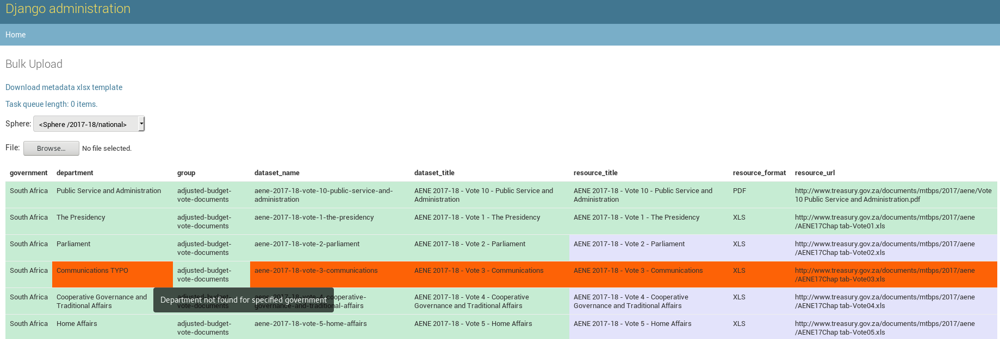
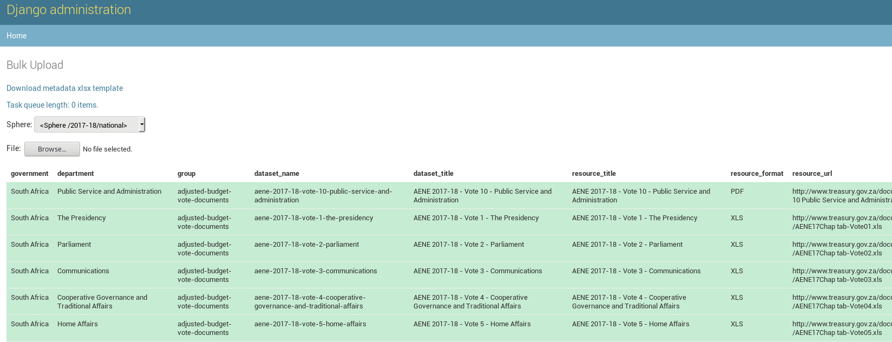
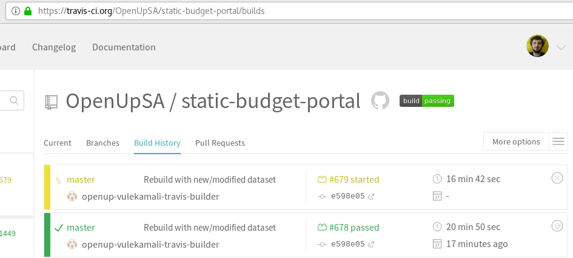
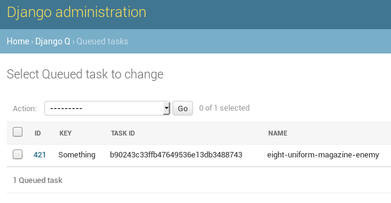
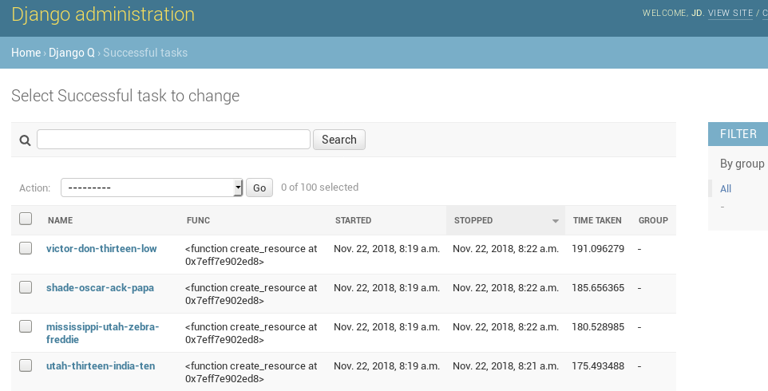
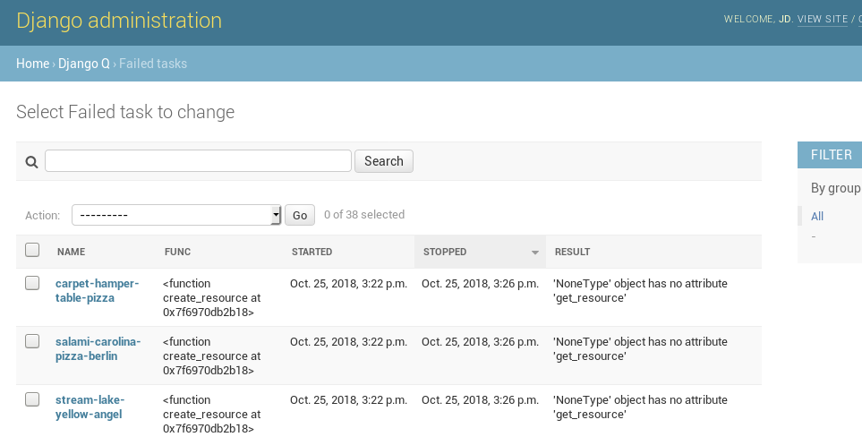

# Bulk-uploading department-specific documents

The Bulk Upload interface allows you to upload many documents at the same time. It is specifically intended for documents that need to be related to specific government departments using metadata. This helps you upload the files, and metadata including filenames, the relevant financial year, the sphere of government, and the department name.

You can only upload documents for one sphere at a time - that is - either national, or provincial.


The bulk upload retrieves each file from the internet via the URLs that should be included in the uploaded spreadsheet. You do not need to upload the actual files yourself.


## Open the Bulk Upload interface

Visit the [Bulk Upload interface](https://datamanager.vulekamali.gov.za/admin/bulk_upload) directly or from the menu on the [Data Manager Admin homepage](https://datamanager.vulekamali.gov.za/admin).


You need to be a [Data Manager Admin](../services/vulekamali-data-manager/adding-data-manager-admin-users.md) to use the Bulk Upload interface.


### Metadata spreadsheet template

You can download a spreadsheet to use as a template for uploading the metadata for your documents. It will include headings and comments on the headings to help you fill in the correct metadata.

### Task queue

Since uploading many documents can take some time, a task queue is used to upload the documents in the background after you submit them \(after previewing the upload\)

Preview bulk upload

## Upload a metadata spreadsheet

[See the guides for specific kinds of documents \(e.g. ENE vote chapters, AENE vote chapters\) for conventions for names and which groups to use](bulk-uploading-department-specific-documents.md#conventions-for-specific-sets-of-documents). 

Read this alongside the [document metadata requirements](bulk-uploading-department-specific-documents.md#requirements-and-specific-sets-of-documents).

1. Select the sphere of government the departments in the spreadsheet are part of
2. Select the metadata spreadsheet file
3. Click Submit


It is important to select the sphere in the correct financial year - since government departments can change year-to-year, their information is organised by financial year throughout the system.



Please ensure your spreadsheet is in XLSX format prior to uploading.


The Bulk Upload interface will check your metadata and show a preview of the changes that will take place



## Preview and start bulk upload

After uploading your metadata file, the Bulk Upload interface will check the metadata against the departments in the Data Manager and the datasets in the Datastore and show what actions it will take.

If you click submit while the Bulk Upload interface shows a preview, it will queue any pending \(blue\) actions.


If upload the same metadata file again, it will re-check your metadata without queuing any pending actions. That way you can see which actions have been completed.


* Green indicates something that is set up correctly already
* Blue indicates something the Bulk Upload interface can take for you
* Red indicates something is wrong

Hover your mouse over the cells in the table to see an explanation of that items current state, e.g. what action it would take\(blue\), or what the problem is \(red\).


It is recommended that you first try a metadata file with only one or two rows, to make sure understand how it works correct. This would minimise the amount of work [fixing any mistakes](bulk-uploading-department-specific-documents.md#correcting-mistakes) the first time you're using this.


When you are ready to upload the documents, click **Submit** below the preview table.

## Check the bulk upload progress

After starting the bulk upload, you'll see the queue length has increased by the number of tasks needed to complete the bulk upload for your spreadsheet.

The easiest way to check that all documents were uploaded successfully is to upload the metadata spreadsheet again with the correct Sphere and preview the bulk upload process again

After the first set of tasks were submitted, and the Communications department spelling mistake was fixed and resubmitted, all documents are now uploaded to the right departments.

Completed uploads can also be seen in the [Datastore](../services/vulekamali-datastore/)

After datasets are modified in the Datastore, \(manually or using the Bulk Upload interface in the Data Manager\), the vulekamali site has to be updated to show the new data or documents and their metadata. The progress of this can be seen in Travis-CI which is used to automate this update. Changes are usually available on vulekamali.gov.za about 30 minutes after they're made in the Datastore.

### Task details

#### Queued tasks

You can check the progress of the queue by clicking on the queue length, or under the Queued tasks section in the Data Manager admin menu. When the Queued task list is empty, all tasks have been completed \(succeeded or failed\)

#### Successful tasks

When the tasks are completed, you should see them on the Successful tasks page. The most helpful information is the start/stop date and time. The task names are just randomly-generated human-readable names for developers to track issues.

#### Failed tasks

Tasks should only fail if an unexpected error occurred - the bulk upload interface tries to only queue tasks it expects to be successful. However if something goes wrong, more information about why it failed can be found in the Result and detail of the task. Click on the name for details.

## Correcting mistakes

You can correct mistakes by finding the relevant dataset in the Datastore, and modifying the dataset in-place.


Note that you can delete a dataset in the Datastore, but it will just be hidden from the public with state "deleted". Bulk Upload interface won't be able to replace it until it's been [purged](https://data.vulekamali.gov.za/ckan-admin/trash).


## Requirements and specific sets of documents

### General requirements

While the vulekamali website uses the metadata of the document datasets to automatically find and link to the correct document for over a hundred departments, we use conventions for naming them to ensure the names and information make sense to users, and ease maintenance.

Metadata spreadsheet requirements

* Only the worksheet named "Resources" will be used.
* One row per document
* Different formats for the same document \(e.g. PDF, XLS\) should be part of the same Dataset, so repeat department and dataset details, and only let the format and URL differ
* resource\_name and resource\_format together are used to identify unique documents that form part of a dataset. You should therefore be consistent in how you name them to avoid ending up with multiple versions of the same document in the system unintentionally.

| Column | Details |
| :--- | :--- |
| government | Must be the government name with standard capitalisation, e.g. South Africa or KwaZulu-Natal |
| group\_id | The ID of the group in the [Datastore ](../services/vulekamali-datastore/)that this document should be part of. Specific document set conventions in this section should indicate which group to use. Find the group\_id in the URL of the group, e.g. for [Adjusted Budget Vote Documents](https://data.vulekamali.gov.za/group/adjusted-budget-vote-documents) use `adjusted-budget-vote-documents` |
| department\_name | Use the department name as in the DataManager. Capitalisation, spelling and hyphenation must match exactly. |
| dataset\_name | Must be unique in the entire system. See the convention for the specific set of documents in this section. We try to make this human-readable but ultimately it is intended to be a computer-readable ID. The Bulk Upload interface will help turn a name like "ENE 2018-19 - Vote 1 - The Presidency" into its slug "ene-2018-19-vote-1-the-presidency" |
| dataset\_title | This is the human-readable title of the dataset. We tend to include the document type abbreviation and financial year in the title to distinguish between the same dataset in different years in search results. |
| resource\_name | This can often be the same as the dataset title, then the format can be used to distinguish between the PDF view of this information, versus the Excel Spreadsheet tables in the PDF. |
| resource\_format | Should be the capitalised extension of the file, e.g. PDF or XLS or XLSX |
| resource\_url | The URL where the document should be found to fetch and upload to the Datastore. |

### Conventions for specific sets of documents


When working with historical documents, check if these conventions were followed or if another convention was used to ensure you don't duplicate.


#### Estimates of National Expenditure Vote Chapters

We create a dataset per vote, and a resource for the PDF part of the ENE book specific to the vote, and a second resource for the spreadsheet used to produce the tables in the PDF.

We use the e-publication PDF rather than the smaller PDF that is just the chapter extract from the full ENE.

* group: budget-vote-documents
* dataset\_name: 
  * document type abbreviation e.g. ENE
  * financial year e.g. 2018-19
  * vote number e.g. Vote 1
  * department name e.g. The Presidency
  * e.g. before sluggifying: ENE 2018-19 - Vote 1 - The Presidency
  * e.g. the slug: ene-2018-19-vote-1-the-presidency
* dataset\_title: Same as the pre-sluggified version, e.g. ENE 2018-19 - Vote 1 - The Presidency
* resource\_name: Same as dataset\_title
* resource\_format: PDF for the e-publication, XLS or XLSX for the spreadsheet used to produce the tables in the e-publication.
* resource\_url: The URL of the file on [http://treasury.gov.za/](http://treasury.gov.za/)

We create a dataset per vote, and a resource for the PDF part of the EPRE specific to the vote, and a second resource for the spreadsheet used to produce the tables in the PDF.

* group: budget-vote-documents
* dataset\_id: 
  * Province code e.g. NW
  * document type abbreviation i.e. EPRE
  * financial year e.g. 2018-19
  * vote number e.g. Vote 1
  * department name e.g. Office of the premier
  * e.g. before sluggifying: _NW EPRE 2018-19 - Vote 1 - Office of the Premier_
  * e.g. the slug: `nw-epre-2018-19-vote-1-office-of-the-premier`
* dataset\_title: Similar to the pre-sluggified dataset\_id except the province in full e.g. _North West EPRE 2018-19 - Vote 1 - Office of the Premier_
* resource\_name: Same as dataset\_title
* resource\_format: PDF for the chapter, XLS or XLSX for the spreadsheet used to produce the tables in the chapter.
* resource\_url: The URL of the file on [http://treasury.gov.za/](http://treasury.gov.za/)

#### Adjusted Estimates of National Expenditure Vote Chapters

We create a dataset per vote, and a resource for the PDF part of the AEPRE specific to the vote, and a second resource for the spreadsheet used to produce the tables in the PDF.

* group: adjusted-budget-vote-documents
* dataset\_id: 
  * Province code e.g. NW
  * document type abbreviation i.e. AEPRE
  * financial year e.g. 2018-19
  * vote number e.g. Vote 1
  * department name e.g. Office of the premier
  * e.g. before sluggifying: _NW AEPRE 2018-19 - Vote 1 - Office of the Premier_
  * e.g. the slug: `nw-aepre-2018-19-vote-1-office-of-the-premier`
* dataset\_title: Similar to the pre-sluggified dataset\_id except the province in full e.g. _North West AEPRE 2018-19 - Vote 1 - Office of the Premier_
* resource\_name: Same as dataset\_title
* resource\_format: PDF for the chapter, XLS or XLSX for the spreadsheet used to produce the tables in the chapter.
* resource\_url: The URL of the file on [http://treasury.gov.za/](http://treasury.gov.za/)

We create a dataset per vote, and a resource for the PDF part of the AENE specific to the vote, and a second resource for the spreadsheet used to produce the tables in the PDF.

* group: adjusted-budget-vote-documents
* dataset\_id: 
  * document type abbreviation e.g. AENE
  * financial year e.g. 2018-19
  * vote number e.g. Vote 1
  * department name e.g. The Presidency
  * e.g. before sluggifying: AENE 2018-19 - Vote 1 - The Presidency
  * e.g. the slug: aene-2018-19-vote-1-the-presidency
* dataset\_title: Same as the pre-sluggified version, e.g. AENE 2018-19 - Vote 1 - The Presidency
* resource\_name: Same as dataset\_title
* resource\_format: PDF for the chapter, XLS or XLSX for the spreadsheet used to produce the tables in the chapter.
* resource\_url: The URL of the file on [http://treasury.gov.za/](http://treasury.gov.za/)

#### Estimates of Provincial Revenue and Expenditure Vote Chapters

#### Adjusted Estimates of Provincial Revenue and Expenditure Vote Chapters

