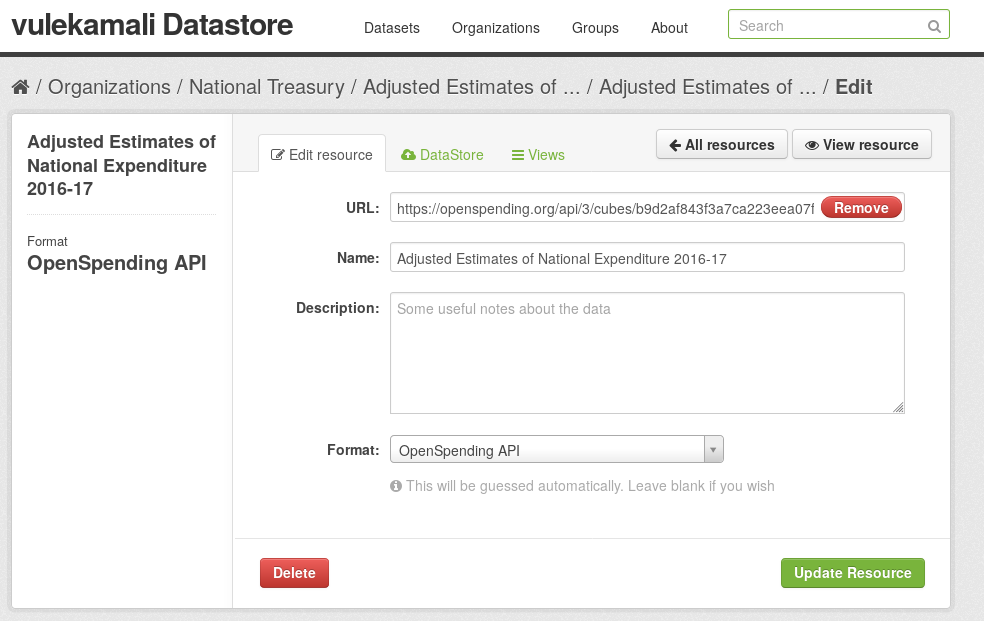
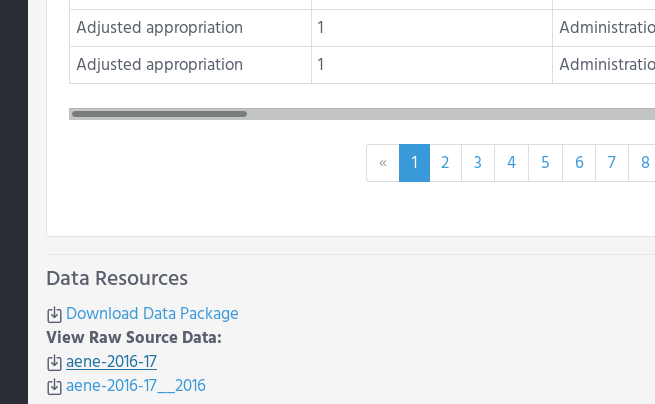
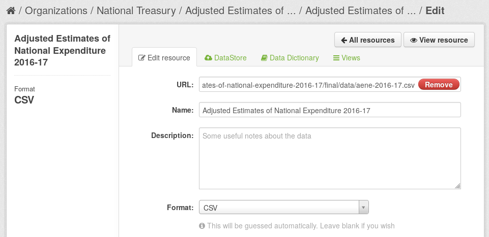

# Adding structured fiscal data

At key budget events like the tabling of the Main Appropriation and Adjustments Appropriation, and release of Annual Report Expenditure data, we upload structured data OpenSpending and make it accessible via the Datastore and vulekamali. This data is intended to support further analysis by the public, and is used for summaries and demonstration of the capability of the data on vulekamali.

To allow automated summaries of the data in vulekamali, the Data Manager has very specific expectations of the structure and values in the data, and how the [Fiscal Data Package](http://frictionlessdata.io/specs/fiscal-data-package/) types used when uploading the data to [OpenSpending](http://openspending.org/).

The consequence of not adhering to these requirements is that the summaries and demonstrations on vulekamali will not work, and will either be broken, or warn that data for the relevant demonstration is missing.

## General requirements for data uploaded to OpenSpending

* At least one "measure" is needed, e.g. the value column
* The value column must be in Rands, not Thousands of Rands 
* The combination of the non-measure columns must be unique on each row
* Financial year must be an integer - for National and Provincial budget data we use the starting year, as is convention. So for 2018-19, we use `2018`.
* Department names and budget phases must match what is used in the Data Manager precisely. That includes capitalisation and punctuation, including hyphenation and commas. Avoid stray spaces at the beginning and end of values. See dataset specifics below.
* Text and numeric values must be consistent. Occasional inconsistencies like stray spaces at the start or end of a value result in that category being treated as a different category, just like it would in a pivot table.

After adding the dataset to the [Datastore](../../services/vulekamali-datastore/), [add it to the right group and add the right metadata](adding-structured-fiscal-data-to-openspending.md#specific-dataset-requirements) so that the [Data Manager](../../services/vulekamali-data-manager/) can find each dataset to prepare the summaries for each financial year using the correct dataset.

## Specific dataset requirements

### Budgeted and Actual National Expenditure

This dataset consists of all the existing years for the  `Expenditure` datasets. 

Only the rows for where `Financial Year` is equal to the dataset's year, and where `Budget Phase` is `Main appropriation` \(e.g. for `ENE 2015-16` only rows where `Financial Year` is equal to `2015)`is included in this combined dataset.`Estimate of National`

[Datastore](../../services/vulekamali-datastore/) Metadata

* Group: [Budgeted and Actual National Expenditure](https://data.vulekamali.gov.za/group/budgeted-and-actual-national-expenditure)
* Sphere: national
* Dimensions: as per the fields available

Fields:

| column name | Fiscal Data Package type | Description |
| :--- | :--- | :--- |
| Vote Number | administrative-classification:generic:level1:code |  |
| Department Name | administrative-classification:generic:level1:label |  |
| Programme Number | activity:generic:program:code |  |
| Programme Name | activity:generic:program:label |  |
| Subprogramme Number | activity:generic:subprogram:code:part |  |
| Subprogramme Name | activity:generic:subprogram:label |  |
| Econ1 | economic-classification:generic:level1:code |  |
| Econ2 | economic-classification:generic:level2:code:part |  |
| Econ3 | economic-classification:generic:level3:code:part |  |
| Econ4 | economic-classification:generic:level4:code:part |  |
| Econ5 | economic-classification:generic:level5:code:part |  |
| Function Group 1 | functional-classification:generic:level1:code |  |
| Financial Year | date:fiscal-year |  |
| Budget Phase | phase:id | Valid values are `Audit Outcome`, `Adjusted appropriation`, `Main appropriation`, `Final appropriation`. This is, in some documents, equivalent to `Medium Term Estimates`  |
| Value | value | The Rand value of the row |
| Amount Kind | value-kind:code | A type like `Total` or `Adjustments - Roll-overs` |
| Government | source:geo-source:code | Always `South Africa` for this national dataset. In the `Actual and Budgeted Provincial Expenditure` dataset this is the Province name |
|  |  |  |

For example, as CSV

```text
Budget Phase,Department,Econ1,Econ2,Econ3,Econ4,Financial Year,Function Group 1,Programme,Programme Number,Subprogramme,Subprogramme Number,Value,Vote Number,Amount Kind,Government
Main appropriation,Public Service and Administration,Current payments,Compensation of employees,Salaries and wages,Salaries and wages,2018,General public services,Administration,1,Ministry,1,31989000.0,10,Total,South Africa
Main appropriation,Public Service and Administration,Current payments,Compensation of employees,Social contributions,Social contributions,2018,General public services,Administration,1,Ministry,1,2213000.0,10,Total,South Africa
Main appropriation,Public Service and Administration,Current payments,Goods and services,Administrative fees,Administrative fees,2018,General public services,Administration,1,Ministry,1,393000.0,10,Total,South Africa
Main appropriation,Public Service and Administration,Current payments,Goods and services,Advertising,Advertising,2018,General public services,Administration,1,Ministry,1,27000.0,10,Total,South Africa
```

### Budgeted and Actual Provincial Expenditure

This dataset consists of all the existing years for the  `Estimates of Provincial Expenditure` datasets. 

Only the rows for where `Financial Year` is equal to the dataset's year, and where `Budget Phase` is `Main appropriation` \(e.g. for `EPRE 2015-16` only rows where `Financial Year` is equal to `2015)`is included in this combined dataset.

[Datastore](../../services/vulekamali-datastore/) Metadata

* Group: [Budgeted and Actual Provincial Expenditure](https://data.vulekamali.gov.za/group/budgeted-and-actual-provincial-expenditure)
* Sphere: provincial
* Dimensions: as per the fields available

Fields:

| column name | Fiscal Data Package type | Description |
| :--- | :--- | :--- |
| Vote Number | administrative-classification:generic:level1:code |  |
| Department Name | administrative-classification:generic:level1:label |  |
| Programme Number | activity:generic:program:code |  |
| Programme Name | activity:generic:program:label |  |
| Subprogramme Number | activity:generic:subprogram:code:part |  |
| Subprogramme Name | activity:generic:subprogram:label |  |
| Econ1 | economic-classification:generic:level1:code |  |
| Econ2 | economic-classification:generic:level2:code:part |  |
| Econ3 | economic-classification:generic:level3:code:part |  |
| Econ4 | economic-classification:generic:level4:code:part |  |
| Econ5 | economic-classification:generic:level5:code:part |  |
| Function Group 1 | functional-classification:generic:level1:code |  |
| Financial Year | date:fiscal-year |  |
| Budget Phase | phase:id | Valid values are `Audit Outcome`, `Adjusted appropriation`, `Main appropriation`, `Final appropriation`. This is, in some documents, equivalent to `Medium Term Estimates`  |
| Value | value | The Rand value of the row |
| Amount Kind | value-kind:code | A type like `Total` or `Adjustments - Roll-overs` |
| Government | source:geo-source:code | In this dataset, this is the Province name e.g. 'North West' or 'Western Cape' |

For example, as CSV

```text
Budget Phase,Department,Econ1,Econ2,Econ3,Econ4,Financial Year,Function Group 1,Programme,Programme Number,Subprogramme,Subprogramme Number,Value,Vote Number,Amount Kind,Government
Main appropriation,Public Service and Administration,Current payments,Compensation of employees,Salaries and wages,Salaries and wages,2018,General public services,Administration,1,Ministry,1,31989000.0,10,Total,North West
Main appropriation,Public Service and Administration,Current payments,Compensation of employees,Social contributions,Social contributions,2018,General public services,Administration,1,Ministry,1,2213000.0,10,Total,Eastern Cape
Main appropriation,Public Service and Administration,Current payments,Goods and services,Administrative fees,Administrative fees,2018,General public services,Administration,1,Ministry,1,393000.0,10,Total,Western Cape
Main appropriation,Public Service and Administration,Current payments,Goods a
```

### Estimates of National Expenditure

[Datastore](../../services/vulekamali-datastore/) Metadata

* Group: [Estimates of National Expenditure](https://data.vulekamali.gov.za/group/estimates-of-national-expenditure)
* Financial Years: Exactly one: the year being tabled
* Sphere: national
* Dimensions: as per the fields available

Fields:

| column name | Fiscal Data Package type | Description |
| :--- | :--- | :--- |
| vote\_number | administrative-classification:generic:level1:code |  |
| department\_name | administrative-classification:generic:level1:label |  |
| programme\_number | activity:generic:program:code |  |
| programme\_name | activity:generic:program:label |  |
| subprogramme\_number | activity:generic:subprogram:code:part |  |
| subprogramme\_name | activity:generic:subprogram:label |  |
| economic\_classification\_1 | economic-classification:generic:level1:code |  |
| economic\_classification\_2 | economic-classification:generic:level2:code:part |  |
| economic\_classification\_3 | economic-classification:generic:level3:code:part |  |
| economic\_classification\_4 | economic-classification:generic:level4:code:part |  |
| economic\_classification\_5 | economic-classification:generic:level5:code:part |  |
| government\_function | functional-classification:generic:level1:code |  |
| financial\_year | date:fiscal-year |  |
| budget\_phase | phase:id | Valid values are `Audited Outcome`, `Adjusted appropriation`, `Main appropriation`, `Medium Term Estimates`. While the newly-tabled budget is classified under `Medium Term Estimates` in some tables in the ENE documents, we classify it under `Main appropriation` for the purposes of analysis from this dataset.  |

For example, as CSV

```text
budget_phase,department,economic_classification_1,economic_classification_2,economic_classification_3,economic_classification_4,financial_year,programme,programme_number,subprogramme,subprogramme_number,value,vote_number
Audited Outcome,Public Service and Administration,Capital,Payments for capital assets,Machinery and equipment,Other machinery and equipment,2011,Administration,1,Ministry,1,311000.0,10
Audited Outcome,Public Service and Administration,Capital,Payments for capital assets,Machinery and equipment,Other machinery and equipment,2012,Administration,1,Ministry,1,112000.0,10
Adjusted appropriation,Public Service and Administration,Capital,Payments for capital assets,Machinery and equipment,Other machinery and equipment,2013,Administration,1,Ministry,1,101000.0,10
```

### Estimates of Provincial Expenditure


Note this dataset is called Estimates of Provincial Expenditure, not Estimates of Provincial Revenue and Expenditure because it only contains expenditure data. While it might throw those who know what the EPRE is, it tries to make sense to users of expenditure data and not leave users wondering where the revenue data is if it was called EPRE.


### 

| Column Name | Description |
| :--- | :--- |
| Government | Spelled out and capitalised normally, i.e. one of `Eastern Cape`, `Free State`, `Gauteng`, `KwaZulu-Natal`, `Limpopo`, `Mpumalanga`, `Northern Cape`, `North West`, `Western Cape` |
| VoteNumber | integer |
| Department | Capitalised and hyphenated correctly - this must be consistent across all datasets on vulekamali otherwise undercounting or errors could occur. |
| ProgNumber | integer |
| Programme | Must be capitalised as it should be presented. |
| SubprogNumber | integer |
| Subprogramme | Must be capitalised as it should be presented. |
| EconomicClassification1 |  |
| EconomicClassification2 |  |
| EconomicClassification3 |  |
| EconomicClassification4 |  |
| EconomicClassification5 |  |
| FunctionGroup1 | Must be capitalised and hyphenated consistently across all datasets on vulekamali \(barring changes from one year to another\) otherwise undercounting or other errors could occur. |
| FunctionGroup2 |  |
| FinancialYear | Integer, e.g. `2018` for the year `2018-19` |
| BudgetPhase | Valid values are `Audited Outcome`, `Adjusted appropriation`, `Main appropriation`, `Medium Term Estimates`. While the newly-tabled budget is classified under `Medium Term Estimates` in some tables in the budget documents, we classify it under `Main appropriation` for the purposes of analysis from this dataset. E.g. the EPRE 2019-20 dataset should have budget phase `Main appropriation` for rows where FinancialYear is `2019` |
| Value | Rands, not thousands of rands |
|  |  |

### Adjusted Estimates of National Expenditure

An additional column `Budget Phase` is added, with budget phase classifications used to model the event in the budget cycle and be consistent with its use in the ENE data.


## Adding a dataset to OpenSpending

Before adding a dataset to OpenSpending, it has to be cleaned and structured correctly and must meet the general and specific requirements above.

### Preparing data to upload to OpenSpending

Any data transformation tools can be used to ensure the data meets the above requirements. We have been using [Datapackage Pipelines](https://github.com/frictionlessdata/datapackage-pipelines) because the declarative nature makes it easy to understand, repeat and reuse, and it's easier to experiment and iterate until the dataset is totally correct than [os-data-importers](https://github.com/openspending/os-data-importers).

[Our Datapackage Pipelines have specifically been used to:](https://github.com/OpenUpSA/treasury-pipelines)

* multiply the _thousands of Rands_ amounts in the source data by 1000 to get amounts in _Rands_
* ensure department names in the data match that used by the Data Manager for automated summaries
* Split Budget Phase and Amount Kind classifications bundled together in the FY\_Descript column of the source data for the AENE and Annual Report Expenditure data.
* Group and sum rows of duplicate classification

The easiest way to add another datapackage pipeline is to copy an existing `pipeline-spec.yaml` file to a similar directory structure for the new financial year and replace references to the old year with the new year.

The CSV output can then be uploaded to OpenSpending Packager.

### Uploading data to OpenSpending Packager

 Login to the vulekamali account on OS Packager and [follow the upload wizard.](https://openspending.org/packager/provide-data)

## Adding OpenSpending datasets to the Datastore

### OpenSpending API for programmatic access

Add the OpenSpending API Model URL as a resource of the dataset.

The model URL can be constructed by entering the dataset ID in OpenSpending in the following template:

```text
https://openspending.org/api/3/cubes/...Dataset ID.../model/
```

The Dataset ID is the combination of the OpenSpending account ID \(`owner` in the Fiscal Data Package JSON file\), and the Fiscal Data Package `name`, with a colon in between. The Fiscal Data Package JSON file can be found at the bottom of the OpenSpending Viewer for the dataset \(_Download Data Package\)_:


So for the above example, the dataset ID is 

```text
b9d2af843f3a7ca223eea07fb608e62a:adjusted-estimates-of-national-expenditure-2016-17
```

and thus the Model URL is

```text
https://openspending.org/api/3/cubes/b9d2af843f3a7ca223eea07fb608e62a:adjusted-estimates-of-national-expenditure-2016-17/model/
```

And this should be added as an `OpenSpending API` format resource to the dataset in the Datastore



### CSV file for manual and programmatic analysis

Add the CSV link to download the full dataset as Comma Separated Variable data which can be opened in Excel and other common data analysis tools.

Find the link at the bottom of the dataset viewer page in OpenSpending - in this case _aene-2016-17_



Copy this link and add it as a CSV type resource of the dataset



These will then show up in vulekamali as a Dataset and in data summaries and demonstrations.

